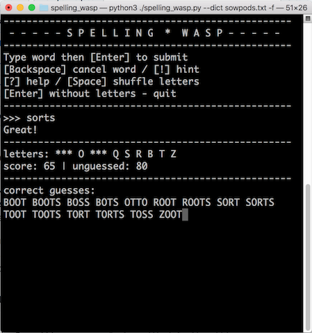

# Spelling Wasp - A Clone of the NY Times Spelling Bee

The NY Times [Spelling Bee](https://www.nytimes.com/puzzles/spelling-bee) game is part of its Crossword section. The player must form words using a set of only seven letters, of which one letter must be included. Letters may be repeated in the word. The more words you find (and the longer they are), the higher your score.

Spelling Wasp is a clone of Spelling Bee, which lets you have some additional control over the configuration and dictionary. You can even play it in other languages, as long as you have a word list for that language (for now only ASCII characters are supported). What's more, you can play new puzzles as often as you like.



## Usage

```bash
python3 spelling_wasp.py # play with default settings
python3 spelling_wasp.py -h # help message and full option list
python3 spelling_wasp.py -f # play in fullscreen mode
python3 spelling_wasp.py --dict my_dictionary.txt # specify your own word list
```

## Dictionary

By default looks in `/usr/share/dict/words` for a word list. However the default word lists that ship with your OS may not be very good. 

An alternative is the SOWPODS word list ([download link](https://www.wordgamedictionary.com/sowpods/download/sowpods.txt)), but you will have to remove the first few lines of explanatory text from the file.

## Full-screen mode

To play the full screen mode you will need the `curses` module in Python. This should be bundled by default in Linux and Mac OS X, but on Windows you may have to install [windows-curses](https://pypi.org/project/windows-curses/) by yourself first.

## To-do

 - [ ] Support characters beyond the ASCII set, for other languages
 - [ ] Add some kind of evaluation to scoring system, and ask user if they want to continue beyond 100 points
 - [ ] Save the game results to a log file
 - [ ] Add colors to the interface
 - [x] Give hints
 - [ ] Progress bar 
